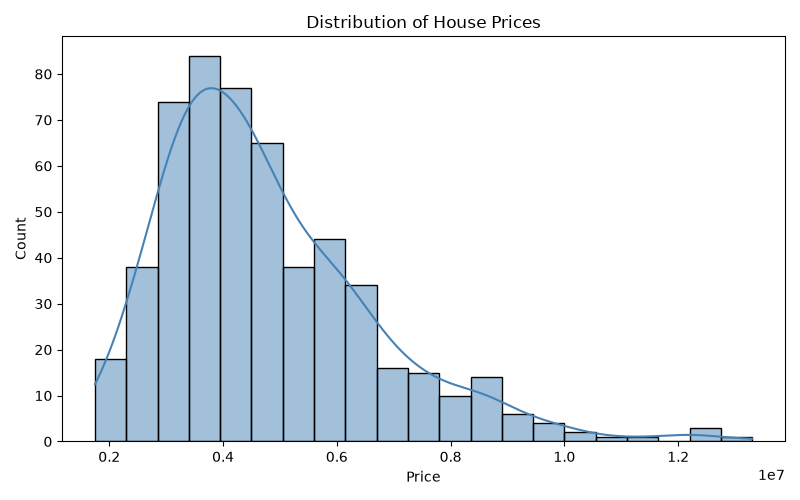
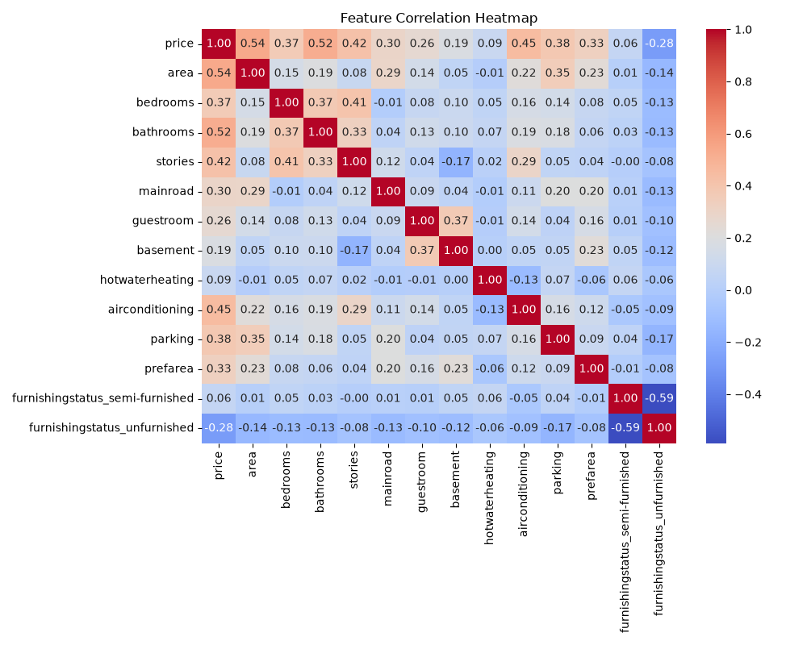
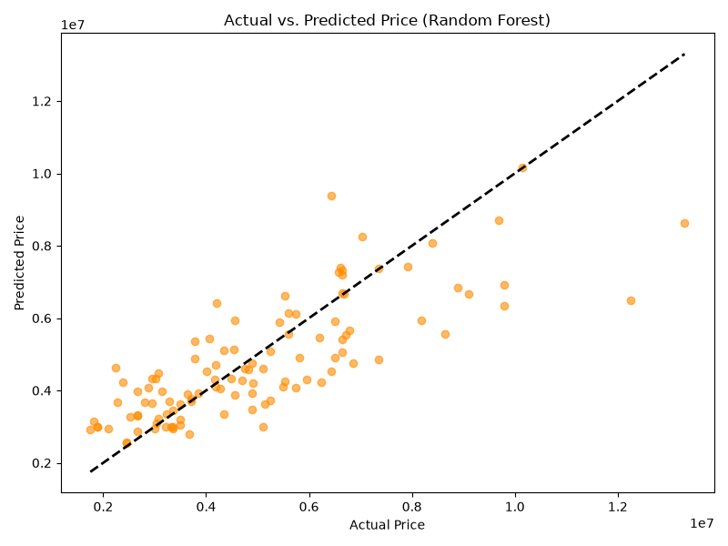

# 🏠 House Price Prediction

A complete **end-to-end machine learning pipeline** for predicting residential house prices using the [Housing dataset](dataset/Housing.csv). The project covers everything from raw data exploration through model training, evaluation, and visualization.

---

## 📌 Table of Contents

- [Overview](#overview)
- [Dataset](#dataset)
- [Project Structure](#project-structure)
- [Pipeline](#pipeline)
  - [Task 1 — Data Loading \& Exploration](#task-1--data-loading--exploration)
  - [Task 2 — Data Cleaning](#task-2--data-cleaning)
  - [Task 3 — Model Building](#task-3--model-building)
  - [Task 4 — Visualization](#task-4--visualization)
  - [Task 5 — Insights](#task-5--insights)
- [Results](#results)
- [Visualizations](#visualizations)
- [Getting Started](#getting-started)
- [Tech Stack](#tech-stack)
- [License](#license)

---

## Overview

This project implements a **full machine learning pipeline** to predict house prices based on various property features such as area, number of bedrooms/bathrooms, amenities, and furnishing status. Two regression models — **Linear Regression** and **Random Forest Regressor** — are trained and compared on standard evaluation metrics.

The entire pipeline is contained in a single Jupyter notebook ([`main.ipynb`](main.ipynb)) and is organized into **5 sequential tasks** that mirror a real-world ML workflow.

---

## Dataset

| Property | Value |
|---|---|
| **Source** | `dataset/Housing.csv` |
| **Rows** | 545 |
| **Columns** | 13 |
| **Target Variable** | `price` |
| **Missing Values** | None |

### Features

| Feature | Type | Description |
|---|---|---|
| `area` | Numeric | Total area of the house (sq. ft.) |
| `bedrooms` | Numeric | Number of bedrooms |
| `bathrooms` | Numeric | Number of bathrooms |
| `stories` | Numeric | Number of stories |
| `mainroad` | Binary | Whether the house is on a main road (`yes`/`no`) |
| `guestroom` | Binary | Whether the house has a guest room (`yes`/`no`) |
| `basement` | Binary | Whether the house has a basement (`yes`/`no`) |
| `hotwaterheating` | Binary | Whether the house has hot water heating (`yes`/`no`) |
| `airconditioning` | Binary | Whether the house has air conditioning (`yes`/`no`) |
| `parking` | Numeric | Number of parking spaces |
| `prefarea` | Binary | Whether the house is in a preferred area (`yes`/`no`) |
| `furnishingstatus` | Categorical | Furnishing status (`furnished` / `semi-furnished` / `unfurnished`) |

---

## Project Structure

```
House-Price-Prediction/
│
├── main.ipynb                  # Full pipeline notebook (Tasks 1–5)
│
├── dataset/
│   ├── Housing.csv             # Raw dataset
│   └── Housing_cleaned.csv     # Cleaned & encoded dataset
│
├── model/
│   ├── linear_regression_model.pkl   # Saved Linear Regression model
│   ├── random_forest_model.pkl       # Saved Random Forest model
│   └── feature_columns.pkl           # Saved feature column names
│
├── charts/
│   ├── price_distribution.png        # Histogram of house prices
│   ├── correlation_heatmap.png       # Feature correlation heatmap
│   └── actual_vs_predicted.png       # Actual vs. predicted scatter plot
│
├── tasks/                      # Individual task notebooks/files
│   ├── task_1/
│   ├── task_2/
│   ├── task_3/
│   ├── task_4/
│   └── task_5/
│
├── requirements.txt            # Python dependencies
├── .gitignore
└── README.md
```

---

## Pipeline

### Task 1 — Data Loading & Exploration

- Load the raw `Housing.csv` dataset using **pandas**
- Inspect shape, data types, and basic statistics (`df.info()`, `df.describe()`)
- Identify the **target variable** (`price`) and **12 feature columns**
- Verify there are **no missing values** in the dataset

### Task 2 — Data Cleaning

- **Handle missing values** — numeric columns filled with median, categorical with mode (robust for future data)
- **Remove duplicate rows** — 0 duplicates found in the current dataset
- **Encode categorical features:**
  - Binary columns (`mainroad`, `guestroom`, `basement`, etc.) → mapped to `1`/`0`
  - `furnishingstatus` → **one-hot encoded** (with `drop_first=True`)
- Save the cleaned dataset to `dataset/Housing_cleaned.csv`

### Task 3 — Model Building

- **Train/Test split** — 80/20 ratio (`random_state=42`)
  - Training set: **436 samples**
  - Test set: **109 samples**
- **Model 1: Linear Regression** — baseline model
- **Model 2: Random Forest Regressor** — ensemble model with `n_estimators=200`
- Models and feature columns saved as `.pkl` files using **joblib**

### Task 4 — Visualization

Three key charts are generated and saved to the `charts/` directory:

1. **Price Distribution** — Histogram with KDE showing the distribution of house prices
2. **Correlation Heatmap** — Visualizes feature-to-feature and feature-to-target correlations
3. **Actual vs. Predicted** — Scatter plot comparing true prices against model predictions

### Task 5 — Insights

- Summary of key findings from EDA and model evaluation
- Identification of the most important features driving house prices
- Recommendations for further model improvement

---

## Results

### Model Comparison

| Model | MAE | RMSE | R² Score |
|---|---|---|---|
| **Linear Regression** | 970,043 | 1,324,507 | **0.6529** |
| Random Forest | 1,014,947 | 1,399,769 | 0.6124 |

> **Best performer:** Linear Regression achieved the highest R² score (**0.6529**), the lowest MAE, and the lowest RMSE on the test set.

---

## Visualizations

### Price Distribution
<p align="center">
  
</p>

### Correlation Heatmap
<p align="center">
  
</p>

### Actual vs. Predicted
<p align="center">
  
</p>

---

## Getting Started

### Prerequisites

- Python 3.8+
- pip

### Installation

1. **Clone the repository**
   ```bash
   git clone https://github.com/CodeBreakerYT/House-Price-Prediction.git
   cd House-Price-Prediction
   ```

2. **Create a virtual environment** (recommended)
   ```bash
   python -m venv venv
   source venv/bin/activate        # Linux/Mac
   venv\Scripts\activate           # Windows
   ```

3. **Install dependencies**
   ```bash
   pip install -r requirements.txt
   ```

4. **Launch the notebook**
   ```bash
   jupyter notebook main.ipynb
   ```

5. **Run all cells** to reproduce the full pipeline end-to-end.

---

## Tech Stack

| Tool | Purpose |
|---|---|
| **Python** | Core language |
| **pandas** | Data loading, cleaning, manipulation |
| **NumPy** | Numerical operations |
| **scikit-learn** | Model training, evaluation, train/test split |
| **Matplotlib** | Chart rendering |
| **Seaborn** | Statistical visualizations (heatmap, histplot) |
| **Jupyter Notebook** | Interactive development environment |
| **joblib** | Model serialization/deserialization |

---

## License

This project is open-source and available for educational purposes.
